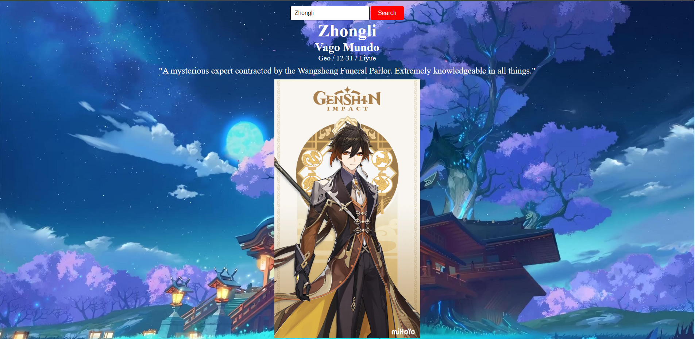

<h1 align="center">Genshin Impact App</h1>

  

  <a href="https://iuliangabriel.github.io/Genshin-Impact-Project/" style="display:inline-block;">Live App</a>

## Overview

This project serves as a Genshin Impact companion app, offering quick access to details about characters within the game. It was commissioned on Fiverr to provide Genshin Impact players with a convenient tool for managing their in-game characters.

## Features

- **Character Information**: Browse and search for detailed information about Genshin Impact characters.
- **Responsive Design**: Ensures a seamless experience across different devices and screen sizes.

## Technologies Used

- HTML5
- CSS3
- JavaScript
- [Genshin Impact API](https://gshimpact.vercel.app).

## Contributions

Contributions are not accepted for this project as it was commissioned work. Feel free to reach out for any inquiries or feedback.

## License

This project is not open-source and is subject to the terms and conditions agreed upon during the commission.
